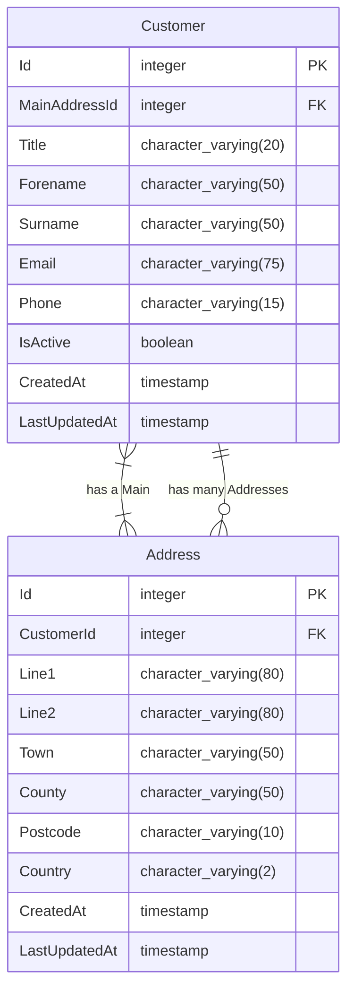

# Project `white-pages`

[](https://opensource.org/licenses/BSD-3-Clause) [](https://github.com/zatarain/white-pages/actions/workflows/api.yml) [](https://codecov.io/gh/zatarain/white-pages)

This project aims to be an API to manage customer contacts and their addresses. The project is an exercise to discuss about software engineering technical topics like software development, testing,  continuos integration, possible deployment, etcetera. More specifically, to discuss the development of an [API (Application Programming Interface)][what-is-api] to **manage customer addresses** written in [.NET Core with C#][dotnet-core]. The name of the whole solution is `White Pages` after the old fashion directory book, so this might be `The Modern White Pages`.

## 📂 Table of content

* 📹 [Overview](#-overview)
  * ☑️ [Requirements](#%EF%B8%8F-requirements)
  * 🤔 [Assumptions](#-assumptions)
* 📐 [Design](#-design)
  * 📊 [Data model](#-data-model)
    * 👤 [Customer](#-customer)
    * ✍🏽 [Address](#-address)
  * 🔚 [End-points](#-end-points)
* 🏗️ [Implementation details](#%EF%B8%8F-implementation-details)
  * 📦 [Dependencies](#-dependencies)
  * 🗄️ [Storage](#%EF%B8%8F-storage)
* ⏯️ [Running](#%EF%B8%8F-running)
* ✅ [Testing](#-testing)
  * 🧪 [Manual](#-manual)
  * ♻️ [Automated](#%EF%B8%8F-automated)
  * 💯 [Coverage](#-coverage)
* 📚 [References](#-references)

## 📹 Overview

This simple API aims to manage a customer addresses database, this means we will have a collection of customers and we will be able to add their addresses. The application should be ready to deploy as a [Docker][docker] container, so we need to generate an image for it available to download in [Docker Hub][docker-hub].

### ☑️ Requirements

The API should be able to manage a database for the customers and each customer may have many addresses related to it. Allowing the client to perform following operations:

* **List all the customers.** It should return the list of all customers in the system.
* **Create a customer.** It should insert a new record for customer provided by the client. However, a customer can only exists once within the database.
* **Deactivate a customer.** It should allow the client to update the status of a given customer to inactive.
* **Delete a customer.** It should allow the client to delete a customer from the system and its addresses.
* **Activate a customer.** It should allow the client to update the status of a given customer to inactive.
* **List only active customers.** It should return the list of active customers in the system.
* **View customer details.** It should show the details of a customer provided by the client and its addresses.
* **Add a new address to a customer.** It should create a new address record for a customer. A customer may have multiple addresses.
* **Delete addresses.** The API should provide a mechanism to delete addresses, but cannot delete the last one, a customer MUST have at least one address.

### 🤔 Assumptions

This just is a small example and either consider some assumptions and/or it's not taking care about some corner case scenarios like following:

* The data transfer objects for the input of all the request and successful responses is JSON or empty.
* The environment variables and secrets (e. g. `POSTGRES_USERNAME` to connect to the database) for API configuration are set in the host machine (see [Running section](#-running) below for more information). In the real world the secrets should be stored and provisioned by an external system (e. g. AWS Secret Manager).
* The storage will be a [PostgreSQL][postgresql] relational database using a [Docker][docker] container with a volume for development.
* The customer and address records are created via separated requests for different end-points. So, when we created a customer is assumed active and without any address.
* In order to create an address we send a URL parameter for `customerId` to the end-point, in the reality this should be taken from the user who is currently authorised via some mechanism like [JSON Web Token][what-is-jwt] (which is not implemented) and sends the request.
* When the main address for a customer is deleted, some of the secondary addresses of the customer will become the new main address, but this one is arbitrarily selected (like just the first result of the query).
* In order to determine whether a customer already exists in the database, we will distinct them based-on Email and Phone fields.
* We will use ALPHA ISO codes for the country. Currently only 3 countries are supported United Kingdom (`GB`), Mexico (`MX`), United Stated (`US`).
* The validation of the postcodes are based on a simple regular expression check depending of the country where is the address, the system doesn't check if the postcode actually exists.
* Even that the API is using asynchronous tasks, we are not using [ACID Database Transactions][acid-transactions], so there could be multi-threading issues like inconsistent data.

## 📐 Design

The architecture will be a HTTP API for a microservice that will consume some configuration and use ORM (via [Entity Framework][ef-docs]) to represent the records in the database tables and also a Model-Controller (MC) pattern design, so the controllers will contain the handlers for the API requests, while the entity models will represent the data. The service will be stateless, so we won't hold any state (e. g. session management) on the server side, instead is designed to be an asynchronous service and use authorisation tokens.

### 📊 Data model

In order to store and manipulate the data needed the API will rely on the entities shown in following diagram:



As we can see in the diagram, a `Customer` _may has_ many `Address`es, which is made possible with the foreign key `CustomerId` within the `Address` entity. Then, a `Customer` _has_ a single `MainAddress`s thanks to the foreign key `MainAddressId`.

The API manages the persistency of the data with a 🐘 [PostgreSQL][postgresql] database, using a 🐳 Docker container with a volume. So, the records for entities shown in the diagram will be stored as rows in tables. PostgreSQL manages a [wide range of data types][postgresql-data-types] so, in order to keep the things simple we will use data type autogenerated by Entity Framework .NET tool for migrations.

#### 👤 Customer

This entity will represent the customers in the system and each record will be stored in the table `Customers` which has following fields:

| ⏹️ | Name            |     Type        | Description                                                |
|:--:| :---            |    :----:       | :---                                                       |
| 🗝️ | `Id`            | `INTEGER`       | Auto-sequence identifier for the customer                  |
| ✳️ | `MainAddressId` | `INTEGER`       | Foreign key for the main address of the customer           |
| 🔤 | `Title`         | `CHARACTER(20)` | **Mandatory**. Title of the customer                       |
| 🔤 | `Forename`      | `CHARACTER(50)` | **Mandatory**. Customer forename                           |
| 🔤 | `Surname`       | `CHARACTER(50)` | **Mandatory**. Customer surname                            |
| 🔤 | `Email`         | `CHARACTER(75)` | **Mandatory**. Email of the customer                       |
| 🔤 | `Phone`         | `CHARACTER(15)` | **Mandatory**. Mobile phone number of the customer         |
| 🗓️ | `CreatedAt`     | `TIMESTAMP`     | Timestamp with time zone representing the creation time    |
| 🗓️ | `LastUpdatedAt` | `TIMESTAMP`     | Timestamp with time zone representing the last update time |

#### 📌 Address

This entity will represent the addresses of the customers in the system and each record will be stored in the table `Addresses` which has following fields:

| ⏹️ | Name            |     Type        | Description                                                |
|:--:| :---            |    :----:       | :---                                                       |
| 🗝️ | `Id`            | `INTEGER`       | Auto-numeric identifier for the address                    |
| ✳️ | `CustomerId`    | `INTEGER`       | Foreign key for the customer                               |
| 🔤 | `Line1`         | `CHARACTER(80)` | **Mandatory**. First line of the address                   |
| 🔤 | `Line2`         | `CHARACTER(80)` | An optional second line for the address                    |
| 🔤 | `Town`          | `CHARACTER(50)` | **Mandatory**. Town, city, village where is the address    |
| 🔤 | `County`        | `CHARACTER(50)` | County or state where is the address                       |
| 🔤 | `Postcode`      | `CHARACTER(10)` | **Mandatory**. A valid postcode based on the country       |
| 🔤 | `Country`       | `CHARACTER(2)`  | **Mandatory**. Country ISO ALPHA-2 code (`GB`, `MX`, `US`) |
| 🗓️ | `CreatedAt`     | `TIMESTAMP`     | Timestamp with time zone representing the creation time    |
| 🗓️ | `LastUpdatedAt` | `TIMESTAMP`     | Timestamp with time zone representing the last update time |

### 🔚 End-points

The input for all the API end-points will be always in JSON format and in most of the cases and the output will be in the same format. The end-points for the API are described in following table:

| Method   | Address                     | Description                            | Success Status | Possible Failure Status            |
| :---:    | :---                        | :----                                  | :---:          | :---                               |
| `HEAD`   | `/health`                   | Service health check                   | `200 OK`       | `*Any*`                            |
| `GET`    | `/customers`                | List of all customers                  | `200 OK`       | `*Any*`                            |
| `GET`    | `/customers/only-active`    | List of active customers               | `200 OK`       | `*Any*`                            |
| `GET`    | `/customers/:id`            | Get customer details and its addresses | `200 OK`       | `404 Not Found`                    |
| `POST`   | `/customers`                | Create a customer record in the system | `200 Created`  | `400 Bad Request`                  |
| `PATCH`  | `/customers/:id/deactivate` | Deactivate a given customer            | `200 OK`       | `404 Not Found`                    |
| `PATCH`  | `/customers/:id/activate`   | Activate a given customer              | `200 OK`       | `404 Not Found`                    |
| `DELETE` | `/customers/:id`            | Delete a customer and its addresses    | `204 NoContent`| `404 Not Found`                    |
| `POST`   | `/addresses/:customerId`    | Create a address record for a customer | `200 Created`  | `400 Bad Request`, `404 Not Found` |
| `GET`    | `/addresses/:id`            | Get details for an address             | `200 OK`       | `404 Not Found`                    |
| `DELETE` | `/addresses/:id`            | Delete an address                      | `204 NoContent`| `400 Bad Request`, `404 Not Found` |

## 🏗️ Implementation details

We are using C# as programming language for the implementation of the API operations. And the database is a container in Postgres to stored locally in development and test environments.

There is a [continuous integration workflow][ci-cd-pipeline] that runs in [GitHub Actions][github-actions] which is responsible to build the API, run the database migrations, unit tests and integration tests, then it generates coverage report.

### 📦 Dependencies

We are using following libraries for the implementation:

* **`Microsoft.AspNetCore.OpenApi`.** A web framework to implement a RESTful API via HTTP.
* **`Microsoft.EntityFrameworkCore`.** A library for Object Relational Model (ORM) in order to represent the records in the database as relational objects.
* **`Npgsql.EntityFrameworkCore.PostgreSQL`.** Adaptation to manage PostgreSQL dialect and connect to the database with .NET Entity Framework.

And also, following ones for the development:

* **`xUnit`.** Framework for unit testing.
* **`FluentAssertions`.** To have more readable assertions on the unit and integration testing.
* **`Moq`.** To create mocks used on unit testing.

### 🗄️ Storage

A Docker container it's not persistent itself, so the Docker Compose file specify a volume to make the database persistent, that volume is mapped to `./data` host subdirectory within repository/solution directory. The [following sections](#-running) will explain how to do that in order to run the API locally.

## ⏯️ Running

In order to build and run the application locally you will need to have Docker installed and internet connection to download the dependency packages and set some environment variables. Optionally, you can open and run the solution file `white-pages.sln` with Microsoft Visual Studio Community Edition.

In your terminal, clone repository, build image and run containers swarm as follow:

```sh
export POSTGRES_HOST=database
export POSTGRES_PORT=5432
export POSTGRES_USERNAME=administrator
export POSTGRES_PASSWORD="my-super-secret-password"

git clone https://github.com/zatarain/white-pages.git
cd white-pages
mkdir data # Create data subdirectory for the database
docker compose up --build
```

That will follow the configuration specified in the [`docker-compose.yml`][compose-yml] file to build the image and run the unit testing on building time, and then run the API in development mode. **Port binding [`-p 7080:80`]:** The image it's built to run the API on port `80` withing the container and is mapped to `7080` on the host machine. Then you can follow the steps to play manually with the API with the steps in next section.

## ✅ Testing

This project is able to be tested in manual way and with automated unit testing. This section will explain how can you play around with the API once you run it following the steps of the [previous section](#-running).

### 🧪 Manual

In order to play around with the API, there are `JSON` files in the directory [`requests/`][json-requests] of the repository for each of [the end-points in the API](#-end-points). There are JSON files for _input_ for the `POST` and `PATCH` end-points and there are examples of _outputs_ returned by the API.

You can play with it in several ways:

1. The API includes swagger for Development environment, so you access via your web browser to `http://localhost:7080/swagger`:


2. The [`requests/`][json-requests] also contains a `white-pages.postman.json` file to import in Postman with a collection of request:


3. Or you can also use `curl` command in your terminal as follow (for instance to create a customer):

```sh
curl -X POST http://localhost:7080/customers --data @requests/customers/create.input.json
```

You will get an output like following:

```json
{
	"id": 1,
	"title": "Mr.",
	"forename": "New",
	"surname": "Customer",
	"email": "mr-newc@customer.com",
	"phone": "+4407223456789",
	"isActive": true,
	"mainAddressId": 0,
	"createdAt": "2023-09-24T14:37:26.3136692Z",
	"lastUpdatedAt": "2023-09-24T14:37:26.3136692Z"
}
```

### ♻️ Automated

Automated unit testing has been implemented and they run on each push and pull requests within the GitHub Actions Pipeline [](https://github.com/zatarain/white-pages/actions/workflows/api.yml). Following is how they are shown in [GitHub website][whitepages-actions]:

Some of those integration testing use [DDT (Data Driven Testing) approach][data-driven-testing] in order to test different inputs for similar scenarios or expected behaviours.

Optionally, you can use Text Explorer in Microsoft Visual Studio to run the unit and integration test:


### 💯 Coverage

You can follow the test coverage reports of this project in the [CodeCov website][codecov-whitepages]:

![Icicle][codecov-icicle]

**IMPORTANT NOTE:** Even that we can see there is a good coverage [](https://codecov.io/gh/zatarain/white-pages), that doesn't mean the API is flawless, as it was mentioned in the [Assumptions section](#-assumptions) there are many chances to improve and further work, and for sure it may have even more.


## 📚 References

* [.NET Core Documentation][dotnet-core]
* [PostgreSQL data types][postgresql-data-types]
* [Entity Framework Documentation][ef-docs]
* [xUnite Documentation][xunit-docs]
* [Moq Documentation][moq-docs]
* [Fluent Assertions Documentation][fluent-assertions-docs]
* [GitHub Actions Documentation][github-actions-docs]

---

[what-is-api]: aws.amazon.com/what-is/api
[what-is-jwt]: https://jwt.io/introduction
[docker]: https://www.docker.com
[docker-hub]: https://hub.docker.com
[white-pages-repo]: https://github.com/zatarain/white-pages
[dotnet-core]: https://learn.microsoft.com/en-gb/dotnet/core/introduction
[postgresql]: https://www.postgresql.org/docs/
[postgresql-data-types]: https://www.postgresql.org/docs/current/datatype.html
[ef-docs]: https://learn.microsoft.com/en-gb/ef/
[fluent-assertions-docs]: https://fluentassertions.com/introduction
[moq-docs]: https://github.com/devlooped/moq
[xunit-docs]: https://xunit.net/#documentation
[github-actions]: https://github.com/features/actions
[github-actions-docs]: https://docs.github.com/en/actions
[codecov-whitepages]: https://app.codecov.io/gh/zatarain/white-pages
[codecov-sunburst]: https://codecov.io/gh/zatarain/white-pages/branch/main/graphs/sunburst.svg?token=55VMMF1IUP
[codecov-grid]: https://codecov.io/gh/zatarain/white-pages/branch/main/graphs/tree.svg?token=55VMMF1IUP
[codecov-icicle]: https://codecov.io/gh/zatarain/white-pages/branch/main/graphs/icicle.svg?token=55VMMF1IUP
[whitepages-actions]: https://github.com/zatarain/white-pages/actions
[ci-cd-pipeline]: https://github.com/zatarain/white-pages/actions/workflows/api.yml
[compose-yml]: https://github.com/zatarain/white-pages/blob/main/docker-compose.yml
[postman-website]: https://www.postman.com
[acid-transactions]: https://en.wikipedia.org/wiki/ACID
[data-driven-testing]: https://en.wikipedia.org/wiki/Data-driven_testing
[json-requests]: https://github.com/zatarain/white-pages/tree/main/requests
[sqlite-viewer]: https://marketplace.visualstudio.com/items?itemName=qwtel.sqlite-viewer
